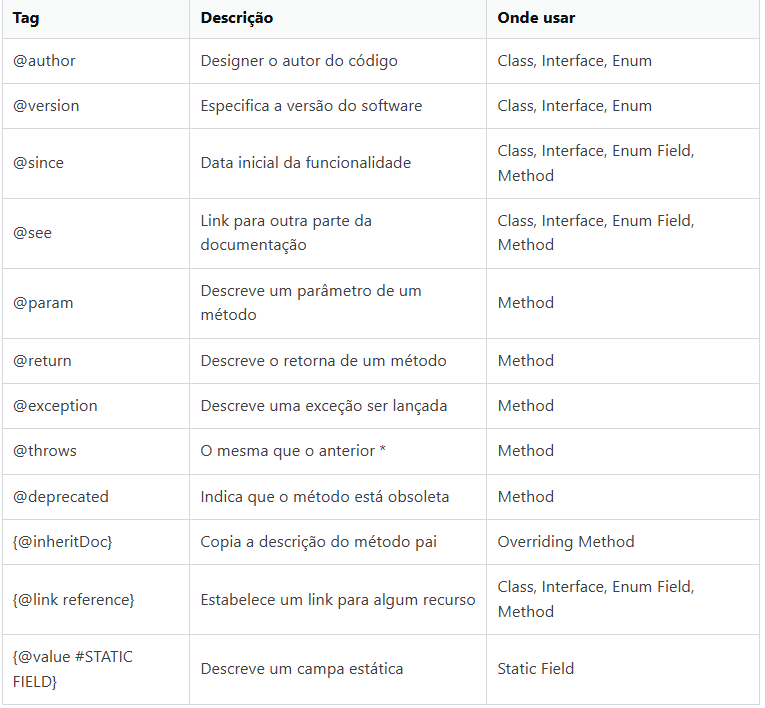

# Java Doc
    Documentação oficial;
    Tags;
    Tipos de comentários;
    Javadoc.

### Documentação oficial
    Uma da maiores caracterísitas da linguagem é ter uma boa documentação.
    Para melhorar na linguagem é preciso entender a documentação oficial da linguagem e dos frameworks que são incorporados nos projetos atuais.

    Links:
       https://docs.oracle.com/javase/8/docs/api/?java/lang/String.html

### Tags
    Java Documentation é composto por tags que representam dados relevantes para a compreensão da proposta de uma classe e os conjuntos de seus métodos e atributos.
    
    Há uma imagem com as tags, descrição e onde usar.
